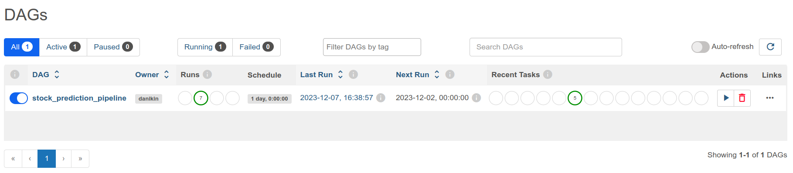
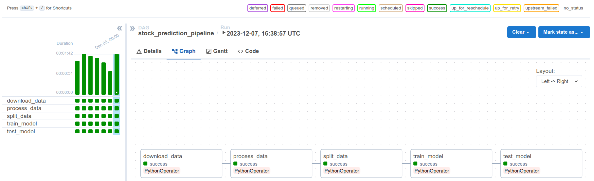
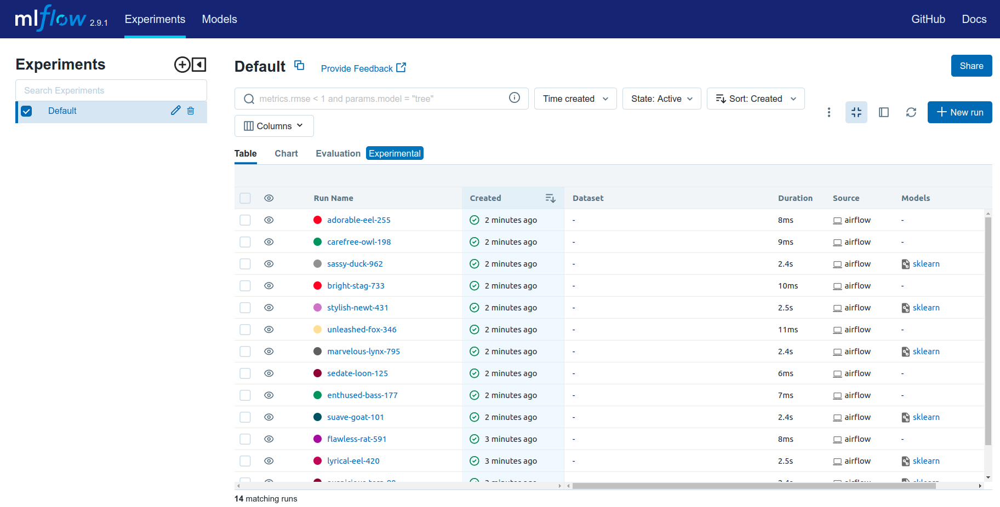

# mlops_2023_task3

## Обзор
Проект реализует ML-конвейер для работы с ценами акций компаний. Он включает скачивание данных, их обработку, 
подготовку признаков, обучение и применение моделей машинного обучения. В проекте используются Airflow для организации 
задач и MLflow для мониторинга процесса обучения.

## 1. Внешний источник данных
- **Используемый источник**: Данные о ценах акций скачиваются с использованием Yahoo Finance API (`yfinance` библиотеки).
- **Скрипт**: `get_data.py` занимается скачиванием данных. Данные загружаются для конкретной компании - (по умолчанию 'MSFT') за заданный период.

## 2. ML-задача
- **Задача**: Прогнозирование цен на акции на основе исторических данных.
- **Модель и метрика**: Используется модель `RandomForestRegressor` из `scikit-learn`. Метрика качества - среднеквадратическая ошибка (MSE).

## 3. Настройка окружения
- **Используемые инструменты**: Airflow для планирования и оркестрации задач, MLflow для мониторинга и логирования результатов обучения.
- **Конфигурация**: Версии необходиых Python-биболоитек определены в `requirements.txt`, включая `apache-airflow`, `mlflow`, `scikit-learn`, `pandas`, и `yfinance`.

## 4. Python скрипты
- **`get_data.py`**: Скачивание данных с помощью `yfinance` API.
- **`process_data.py`**: Обработка и преобразование данных, которая включает добавление лаговых переменных.
- **`train_test_split.py`**: Разделение данных на тренировочный и тестовый наборы.
- **`train_model.py`**: Обучение модели и логирование в MLflow.
- **`inference.py`**: Загрузка обученной модели и оценка ее качества на тестовых данных.

## 5. Airflow
- **DAG**: `airflow_pipeline.py` определяет задачи и их последовательность.
   
- **Tasks**:
    - Скачивание данных (`download_data`).
    - Обработка данных (`process_data`).
    - Разделение данных (`split_data`).
    - Обучение модели (`train_model`).
    - Тестирование модели (`test_model`).
  
- **Конфигурация**:
  - В файле конфигурации изменены два параметра `airflow.cfg`:
    ```
    dags_folder = ./dags
    load_examples = False
    ```
  - Перед запуском Airflow установлены переменную окружения:
    ```commandline
    export AIRFLOW_HOME=<путь/до/репозитория>
    ```

## 6. MLflow
- **Логирование**: Параметры, метрики и модели логируются в MLflow в скриптах `train_model.py` и `inference.py`.
- **Артефакты**: Модели и метрики качества сохраняются для каждого запуска пайплайна.
  

